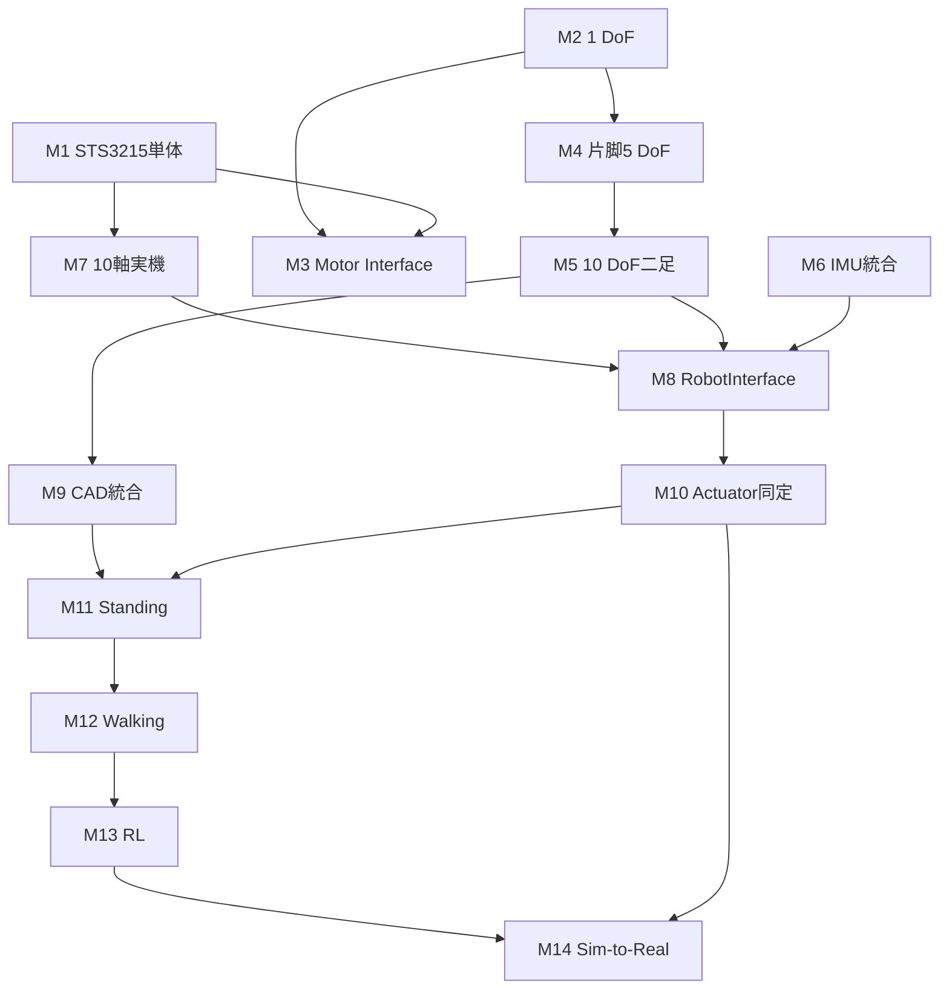

# First_tekuteku プロジェクト概要

- Previous: [README.md](README.md)
- Next: [01_real_hardware.md](01_real_hardware.md)
- Overview: 本文書
- Related Reference: [software_architecture.md](reference/software_architecture.md)，[joint_definition.md](reference/joint_definition.md)，[coordinate_system.md](reference/coordinate_system.md)，[decision_pending.md](reference/decision_pending.md)

## 1．開発目的

本プロジェクトの最終目標は，Disney BDX / Microduckのような小型二足歩行ロボットを，自ら理解した設計と実装によって構築することである．完成済みGitHubリポジトリを複製して動かすことを目的としない．モータ通信，センサ通信，状態表現，物理シミュレーション，関節制御，共通Interface，二足モデル，CAD統合，実アクチュエータモデル，姿勢制御，歩行制御，強化学習，Sim-to-Realを順に理解し，検証結果を次の層へ積み上げる．

Pollen Robotics Microduck，`microduck_rl`，Open Duck Mini，SO-101等はReference Implementationとして扱う．用途は設計比較，実装確認，トラブルシュート，自作コードの検証であり，本プロジェクトの実装を置き換えるものではない．公式documentationは，通信仕様やAPIの一次情報として参照する．

## 2．設計原則

### 2.1 共通Controller

最終構成は次のとおりである．

```text
                         Controller
                             │
                             ↓
                      RobotInterface
                       /           \
                      /             \
                     ↓               ↓
             MuJoCoRobot          RealRobot
                    │                 │
                 MuJoCo       ┌───────┼─────────┐
                              │       │         │
                           STS3215   XL330      IMU
                              │       │         │
                          Seeed×2   OpenRB     ATOM
```

Controllerの基本処理は次の形とする．

```python
state = robot.read_state()
command = controller.update(state)
robot.send_command(command)
```

Controllerは，接続先がMuJoCoか実機かを可能な限り意識しない．ただし，実機固有の安全状態や通信異常を隠蔽してはならない．共通化とは差異を消去することではなく，単位，関節順序，時刻，指令意味を同じ契約へ写像することである．

### 2.2 段階的な現実化

モデルは次の順で現実へ近づける．

```text
Ideal primitive model
        ↓
CAD geometry and inertial model
        ↓
Identified actuator model
        ↓
Domain-randomized model
```

CAD完成前にもSimulationとControllerを進める．CAD導入時に変更するのは主にjoint location，joint axis，link length，mass，center of mass，inertia tensor，visual mesh，collision geometry，joint rangeである．joint name，joint ordering，software interface，`RobotState`，`RobotCommand`，Controller interfaceは原則として維持する．

### 2.3 単位と境界

内部計算はSI単位系とする．角度はrad，角速度はrad/s，位置はm，速度はm/s，質量はkg，トルクはN m，時間はsである．Servoのraw値はHardware Driverの境界で変換し，Controllerや共通ログへ漏らさない．詳細は[座標系と単位](reference/coordinate_system.md)を正とする．

### 2.4 最小構成からの拡張

抽象化は必要になった時点で導入する．最初から大規模なframeworkを作らず，1モータ，1 DoF，最小Interfaceで理解と計測を成立させた後にrefactoringする．一方，関節名，符号，SI単位等の境界契約は早期に固定し，実機とSimulationの分岐を上位層へ持ち込まない．

## 3．並行開発の進め方

Real HardwareとSimulationを独立に最後まで完成させてから接続すると，単位，関節符号，時刻，指令意味のずれが遅れて発覚する．そこで，両者とCommon Interfaceを短い周期で交互に発展させる．

```text
Real Hardware
     ↕
Simulation
     ↕
Common Interface
```

推奨する交互開発Stageは次のとおりである．

| Stage | Real Hardware | Simulation / Common | Exit evidence |
|---:|---|---|---|
| 1 | Seeed Driver BoardをWindowsで認識 | MuJoCoを導入しViewerを起動 | COM記録，環境version記録 |
| 2 | STS3215単体を読出し | 1 DoF振り子 | register読出し，$q,\dot q$ログ |
| 3 | STS3215を小角度駆動 | 1 DoF PD Servo | 安全な往復，step response |
| 4 | pyserial最小Driver | `SimulatedMotor` | 両実装の単体test |
| 5 | `STS3215Motor` | 共通`MotorInterface` | 同一の単位とmethod意味 |
| 6 | 単体実機 | 共通Controller | 同じControllerの切替実行 |
| 7 | 2〜5軸へ拡張 | 片脚5 DoF | joint-by-joint確認 |
| 8 | 10軸へ拡張 | 10 DoF二足 | 全関節の対応表とログ |
| 9 | ATOM IMU | 仮想IMU | 共通frameでの静止試験 |
| 10 | `RealRobot` | `MuJoCoRobot` | 共通`RobotState`とログ |

## 4．Phase一覧

### Phase 1：Real Hardware基盤

- **目的**：PCから1個のSTS3215を安全に読み書きし，理解した通信を10軸へ段階的に拡張する．XL330とIMUも独立に確認する．
- **前提条件**：所有機材の現物確認，安全な作業領域，Windows PC，5 V / 4 A電源，緊急停止手順．
- **作業内容**：Driver Board認識，公式SDKによる基準確認，packet理解，pyserial Driver，raw↔SI変換，zero・方向校正，1→2→5→10軸，XL330，IMU，安全機能．
- **成果物**：inventory，配線図，port設定，register根拠，Driver仕様，calibration，test log，安全試験記録．
- **完了条件**：10軸STS3215，4軸XL330，IMUをPCから取得・制御でき，limit，timeout，watchdog，torque disable，emergency stopが検証済みである．
- **次Phaseとの関係**：実測した状態・指令の意味と制約をPhase 3へ渡す．

### Phase 2：Simulation基盤

- **目的**：MuJoCoとMJCFを理解し，コピーではない10 DoFモデルを段階的に構築する．
- **前提条件**：Python環境，MuJoCo，座標系と関節命名の初期案．
- **作業内容**：Ground，Free Body，1 DoF Pendulum，Torque Input，PD Servo，`SimulatedMotor`，片脚，二足，足裏接触，仮想IMU．
- **成果物**：MJCF，simulation script，step response，primitive model，sensor mapping，test log．
- **完了条件**：10 DoFの$q,\dot q$取得と位置指令，接触，仮想IMU，HOME保持が再現可能である．
- **次Phaseとの関係**：共通Interfaceへ接続可能な`MuJoCoRobot`と理想モデルをPhase 3へ渡す．

### Phase 3：Real / Simulation統合

- **目的**：同一Controllerから`RealRobot`と`MuJoCoRobot`を切り替え，結果を同じ形式で比較可能にする．
- **前提条件**：単体実機Driver，1 DoF以上のSimulation，関節順序，SI単位．
- **作業内容**：`RobotState`，`RobotCommand`，`MotorInterface`，`RobotInterface`，timestamp，ログ，Hold Position試験，STS3215同定，段階的アクチュエータモデル化．
- **成果物**：interface contract，共通config，共通CSV schema，比較plot，同定parameter．
- **完了条件**：共通Controllerが両backendで同じ関節を同じ符号・単位で扱い，異常を検出して安全側へ遷移する．
- **次Phaseとの関係**：CAD置換後も維持するsoftware contractと比較基準をPhase 4へ渡す．

### Phase 4：CAD統合

- **目的**：ideal primitive modelをCAD由来のgeometryと物性へ置換し，software architectureを壊さず実機形状へ近づける．
- **前提条件**：10 DoF ideal model，関節定義，CAD assembly，単位・座標変換の理解．
- **作業内容**：joint center・axis，link length，mass，CoM，inertia，rangeの抽出，visual mesh導入，単純collision作成，段階的検証．
- **成果物**：CAD-to-MJCF変換表，mesh，inertial table，collision model，before/after regression結果．
- **完了条件**：関節名とInterfaceを変更せず，質量・姿勢・接触・可動域のsanity checkを通過する．
- **次Phaseとの関係**：姿勢・歩行制御に必要な幾何・物性モデルをPhase 5へ渡す．

### Phase 5：Control，RL，Sim-to-Real

- **目的**：古典制御で基盤を検証した後，Standing，Balance，Walking，RL，Sim-to-Realへ進む．
- **前提条件**：共通Interface，CAD model，安全な実機試験，アクチュエータ同定．
- **作業内容**：HOME保持，30 s Standing，IMU feedback，軌道・IK，LIPM/ZMP/MPCの検討，PPO等のRL，domain randomization，実機移行．
- **成果物**：controller仕様，評価metric，trajectory，policy，randomization範囲，実機試験記録．
- **完了条件**：各段階の定量基準を満たし，Simulationと実機の差が記録・説明され，安全制約下で再現できる．
- **次Phaseとの関係**：最終Phaseであり，結果は次の設計iterationとDecision Pendingの解消へ戻す．

## 5．マイルストーン

| ID | マイルストーン | 主な証拠 | 対応Phase |
|---|---|---|---|
| M1 | PCからSTS3215単体を制御 | ping，telemetry，小角度往復log | 1 |
| M2 | MuJoCo 1自由度モデル完成 | MJCF，$q,\dot q$，step response | 2 |
| M3 | Real / Sim共通Motor Interface | contract test，backend切替結果 | 3 |
| M4 | 片脚5 DoFモデル | 全5軸の±角度確認 | 2 |
| M5 | 10 DoF二足モデル | 全10軸mapping，接触試験 | 2 |
| M6 | IMU統合 | 実・仮想IMUのframe確認 | 1，2，3 |
| M7 | 10軸実機通信 | cycle，error，温度，電圧log | 1 |
| M8 | RobotInterface共通化 | 同一Controllerの両backend試験 | 3 |
| M9 | CADモデル統合 | inertial表，mesh，regression | 4 |
| M10 | 実アクチュエータ同定 | step/sine比較，同定parameter | 3 |
| M11 | Standing | 30 s立脚と安全停止記録 | 5 |
| M12 | Walking | 定義済み距離・歩数の再現試験 | 5 |
| M13 | RL | 学習curve，評価seed，baseline比較 | 5 |
| M14 | Sim-to-Real | 実機試験，gap分析，rollback条件 | 5 |

M12〜M14の具体的な性能値は未決定である．成功条件は実験前に[未決定事項](reference/decision_pending.md)で確定する．

## 6．依存関係



| 下流作業 | 必須の上流成果 | 理由 |
|---|---|---|
| 複数モータ試験 | 単体読出し，小角度試験，緊急停止 | 誤配線・誤ID・暴走の影響を限定するため |
| 二足モデル | 片脚全軸の符号確認 | 左右mirrorによる符号誤りを持ち込まないため |
| 共通Controller | SI変換，joint ordering，timestamp | backend差をControllerへ漏らさないため |
| CAD統合 | ideal modelのregression test | geometry変更とsoftware不具合を分離するため |
| Standing | CAD物性，接触，actuator limit，安全機能 | 転倒・過負荷とmodel不一致を抑えるため |
| Walking | StandingとBalanceの定量達成 | 動的運動の前に状態推定と姿勢安定を確認するため |
| RL | deterministic baselineと再現可能なSimulation | policy不具合と環境不具合を区別するため |
| Sim-to-Real | 同定，randomization，実機安全gate | Simulation固有のpolicyを無防備に実機へ送らないため |

## 7．基盤完成の判定

「ロボット制御基盤完成」は，以下をすべて満たした状態と定義する．

### Real Hardware

- STS3215 ×10をPCから制御できる．
- XL330 ×4をPCから制御できる．
- IMUをPCから取得できる．
- joint limit，velocity limit，command rate limit，communication timeout，watchdog，torque disable，emergency stopを検証済みである．

### Simulation

- 10 DoF二足モデルがある．
- joint position / velocityの取得とjoint commandが可能である．
- 足裏接触と仮想IMUが利用可能である．

### Common Software

- `RobotState`，`RobotCommand`，`RobotInterface`，ログ形式が共通化されている．
- 同一Controllerをbackend切替だけで使用できる．

### CAD移行性

- mesh，mass，CoM，inertia，joint location等を更新しても，joint nameとsoftware contractが維持される．

## 8．安全と変更管理

生成したコードを安全確認なしに複数モータ実機へ適用してはならない．実機指令は，単体，無負荷，低速，小角度から始め，物理的な電源遮断手段を確保する．起動時は現在位置を読み，現在位置から離れた目標を即時送信しない．通信停止時の挙動を通常系と同じ重要度で試験する．

joint limit，torque limit，control rate，communication rate，battery等は現時点で未決定である．根拠なしに数値を固定せず，実測と安全marginを伴うdecision recordを残す．

## 9．全体実行チェックリスト

- [ ] Phase 1の単体実機試験と安全gateを完了した
- [ ] Phase 2の1 DoF試験と10 DoFモデルを完了した
- [ ] Phase 3の共通Interfaceとログ比較を完了した
- [ ] Phase 4のCAD置換とregressionを完了した
- [ ] Phase 5の各制御段階を順序どおり評価した
- [ ] Decision Pendingを各試験前に必要な範囲で解消した
- [ ] 全実験にcommit，構成，version，設定，結果が記録されている

## Phase Completion Criteria

本Overviewの完了条件は，各Phaseの目的，入力，出力，依存関係，M1〜M14，および基盤完成条件が互いに矛盾せず，詳細手順へリンクされていることである．個別Phaseの完了は，各Phase文書のCompletion Criteriaで別途判定する．
